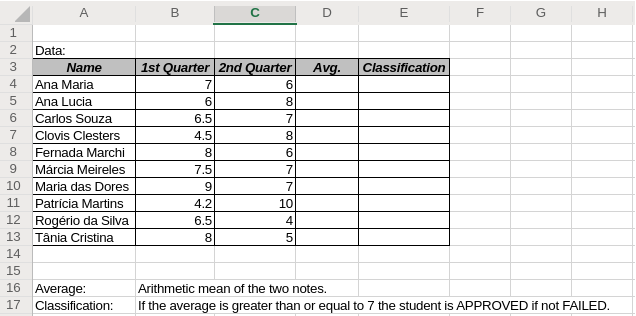
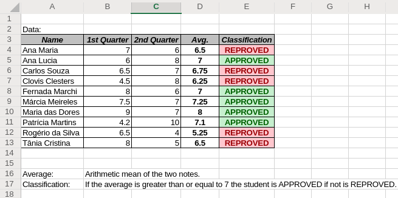

# If Function exercises

The IF function is one of the most popular functions in [MS Excel](https://products.office.com/en-us/excel), and it allows you to make logical comparisons between a value and what you expect.

So an IF statement can have two results. The first result is if your comparison is __True__, the second if your comparison is __False__.

## Material used

* If Function List No. 1

### Question No. 1



#### Solution question No. 1

On cell __D4__ write the following formula:

```javascript
=SUM($B4+$C4)/2
```

Notice we've locked the columns. Now is safe to drag the bottom right corner of the cell __D4__ till reach cell __D13__.

If you are confused, take a look to the gif below.


On cell __E4__ write the following formula:

```javascript
=IF($D4>=7,"APPROVED","REPROVED")
```

Notice we've locked the columns. Now is safe to drag the bottom right corner of the cell __E4__ till reach cell __E13__.

Last but not least important, use the conditional formatting to highlight the classification column values. You must *Select Conditional Formatting* ➜ *Highlight Cells Rule* ➜ *Equal To...*, now if text is APPROVED fill it with green, if text is REPROVED fill it with red.

If you are confused, take a look to the gif below.


Final result must look like this:


